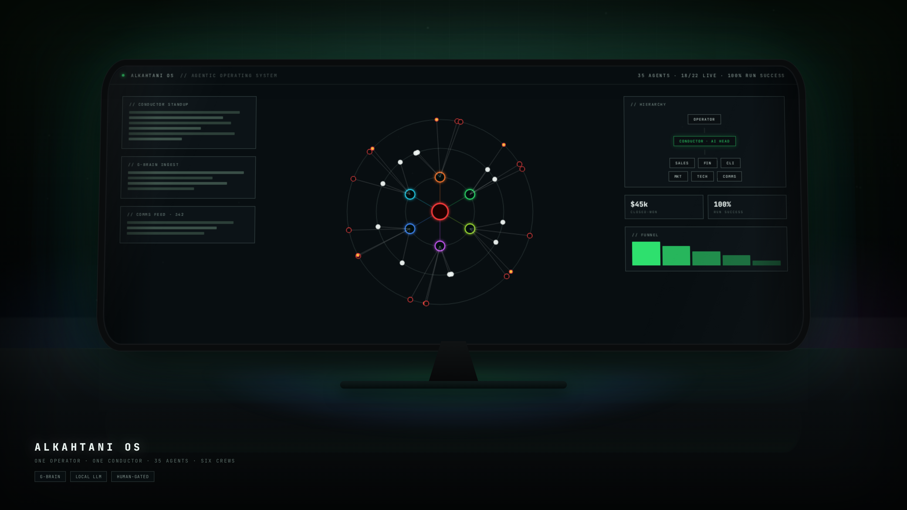

# ALKAHTANI OS

An Agentic Operating System: one human Operator, one **CONDUCTOR** super-agent
(AI HEAD, **Grok API** `grok-4`, local fallback), six crews, **35 agents**, a pgvector-backed
**G-BRAIN** knowledge core, and a live business dashboard — dark
terminal-brutalist UI throughout.



## Layout

```
schema.sql                     Postgres 16 + pgvector DDL (v3) — auto-applied by compose
seed.sql                       generated · 114 nodes / 35 agents / 22 connectors / demo KPIs
scripts/generate_vault_and_seed.py   regenerates vault/ + seed.sql (deterministic uuidv5)
vault/agents/*.md              35 git-versioned agent identities (AGENT CONTRACT)
apps/api                       Fastify + TS · auth, system status, G-Brain ingest/graph/search
apps/web                       Next.js + Tailwind · sidebar shell, G-Brain radial page
design/mockups                 10 hi-fi HTML/SVG mockups + rendered PNGs (design source of truth)
docs/                          PLAN.md · API.md · AGENT_CONTRACT.md
```

## Quickstart

```bash
cp .env.example .env                          # set OPERATOR_TOKEN and XAI_API_KEY (Grok)
python3 scripts/generate_vault_and_seed.py    # → vault/ + seed.sql (already committed)
docker compose up -d --build                  # db auto-runs schema + seed
docker compose exec ollama ollama pull bge-m3        # embeddings stay local (1024-dim)
docker compose exec ollama ollama pull qwen3:8b      # optional: LLM fallback when Grok is down
docker compose --profile asr up -d whisper          # only if you need voice ingest

# smoke (M1+M2 gates)
H="Authorization: Bearer local-dev-token"
curl localhost:8080/health
curl -H "$H" localhost:8080/api/v1/system/status
curl -H "$H" -F "text=Keep Attio clean: move the sales-call roster to the vantage lane." \
     localhost:8080/api/v1/gbrain/ingest
curl -H "$H" -X POST -H "Content-Type: application/json" \
     -d '{"query":"attio clean roster"}' localhost:8080/api/v1/gbrain/search
curl -H "$H" localhost:8080/api/v1/gbrain/stats
open http://localhost:3000/g-brain
```

## Milestones

| # | Scope | Status |
|---|---|---|
| M1 | Skeleton: monorepo, docker, operator auth, nav shell, theme | **code in repo** — run compose gate locally |
| M2 | G-Brain: ingest → md → chunk → embed pipeline, graph API, radial view | **code in repo** — run smoke gate locally |
| M3 | Runtime: vault loader, scheduler, run log, tmux crews, Conductor loop | **code in repo** — `bash scripts/smoke/m3.sh` |
| M4 | Crews + MCP connector modules w/ health probes | vault + registry seeded; probes pending |
| M5 | Dashboard / funnel / task board APIs + UI | mockups final; APIs pending |
| M6 | Hardening: alerts, nightly self-report, backups, docs | pending |

## Design

The 10 UI mockups in `design/mockups/` are real HTML/SVG (JetBrains Mono,
validated dept palette, one token sheet in `base.css`) — the frontend
reproduces them with react-force-graph + Tailwind, rendering text from the
API, never bitmaps. Re-render with `node shot.mjs` inside that folder.
